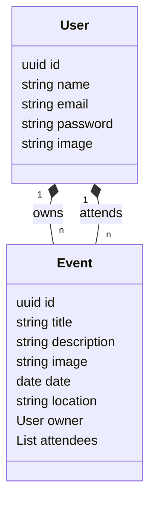

# Events API

Events API is a simple application built with Spring Boot. It allows users to create, update, delete, attend, and unattend events.

This project is the back-end part of the [Events APP](https://github.com/wesleybertipaglia/events-app) project.

## Table of Contents

- [Getting Started](#getting-started)
- [Features](#features)
- [ERD Diagram](#erd-diagram)
- [Contributing](#contributing)
- [License](#license)

## Getting Started

### Prerequisites
- Java 17 or later
- Maven
- OpenSSL

1. Generating `app.key` and `app.pub`:
```bash
openssl genrsa -out src/main/resources/app.key 2048 
openssl rsa -in src/main/resources/app.key -pubout -out src/main/resources/app.pub
```

2. Running with Maven
```bash
mvn spring-boot:run
```

3. Accessing the Application
- API: [http://localhost:8080](http://localhost:8080)
- Swagger: [http://localhost:8080/swagger-ui/index.html](http://localhost:8080/swagger-ui/index.html)

## Features

The application includes the following functionalities:

- Authentication and authorization
- Create, update, delete own events
- Attend, unattend other events
- List events with pagination
- Sort events (by creation date, update date, title, description, location, date)
- Filter events (by title, description)

## ERD Diagram

The following Entity-Relationship Diagram (ERD) shows the relationships between the entities in the application:



## Contributing

Contributions are welcome! Please fork the repository and submit a pull request with your changes.

## License

This project is licensed under the MIT License - see the [LICENSE](./LICENSE) file for details.
